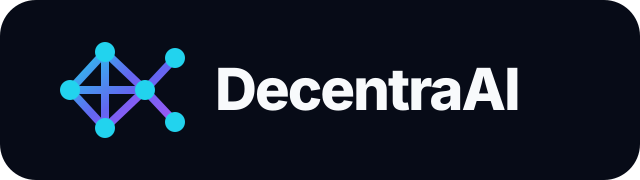
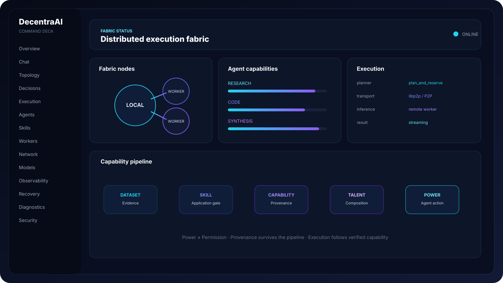
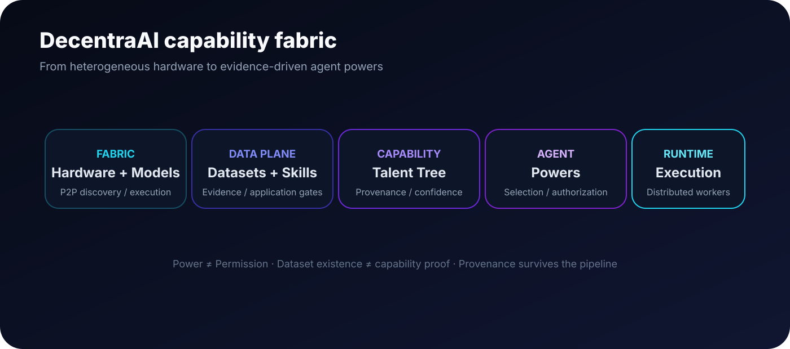

<div align="center">


# DecentraAI

### Distributed AI · Shared capabilities · Collective execution

**A Rust-based AI execution fabric for models, agents, datasets, skills, capabilities and distributed inference.**

</div>

---

> **DecentraAI is not another chatbot.** It is infrastructure for turning heterogeneous machines, local models, datasets and agents into a cooperative AI fabric.

## The idea

**Machines should not merely share compute — they should share capabilities.**

A worker contributes hardware and models. A dataset contributes evidence. A skill applies that evidence. A capability becomes available. The Talent Tree organizes what can be composed. Agents use those capabilities. The fabric decides where execution should happen.



## Architecture



```text
Hardware → Models + Tools → Datasets → Skills → Capabilities
                                      ↓
Talent Tree → Agent Powers → Distributed Execution
```

### Trust model

DecentraAI deliberately separates **evidence, capability and authority**.

- **Power ≠ Permission**
- **Dataset existence ≠ capability proof**
- **Skill existence ≠ capability proof**
- Provenance must survive capability construction
- Verified evidence must not be silently downgraded
- Runtime selection must respect actual worker capabilities

---

# 🌐 Distributed Fabric

DecentraAI is built around a peer-to-peer execution fabric.

```text
User / Agent Request
        ↓
Planner → Scheduler / Router
        ↓
DecentraAI Fabric
   ↙        ↓        ↘
Laptop   Desktop   Future Worker
   ↓        ↓          ↓
Local    Local      Local Model
Model    Model
   └────────┴──────────┘
             ↓
          Inference
```

The project moves from `one machine → one model → one agent` to `many machines → many models → many capabilities → coordinated agents → shared execution`.

The universal node is both **coordinator + worker**. Discovery, trusted admission, capability-aware planning, reservations, remote inference, streaming, worker reuse and bidirectional execution form the fabric foundation.

---

# 🤖 Agents

Agents are not isolated prompt wrappers. The runtime is designed around:

- model selection
- capability matching
- tools
- memory
- reputation
- resource constraints
- distributed execution
- recovery
- provenance

The central question is:

> **What can I actually do, why do I believe I can do it, and where should the work execute?**

---

# 🧩 Dataset → Skill → Capability → Talent → Power

The Dataset/Skill layer is the bridge between artifacts and agent capabilities.

```text
Dataset
   ↓ evidence
Skill
   ↓ application gate
Capability
   ↓ provenance + confidence
Talent Tree
   ↓ composition
Agent Power
   ↓ authorization
Real execution
```

A dataset does **not** magically grant an agent a power. Capability claims must remain bounded by their supporting evidence.

The Talent Tree answers:

```text
What capabilities exist?
Where did they come from?
How confident are we?
What prerequisites exist?
Which talents become available?
Which agents can use them?
```

---

# 🖥️ Command Deck

The Command Deck is the operational surface of DecentraAI — an infrastructure control plane rather than a conventional chat dashboard.

| Surface | Purpose |
|---|---|
| Overview | Fabric health |
| Chat | Interactive inference |
| Topology | Distributed nodes |
| Decisions | Planner/routing decisions |
| Execution | Runtime execution |
| Agents | Agents + capabilities |
| Skills | Dataset/Skill pipeline |
| Workers | Compute workers |
| Network | P2P state |
| Models | Model state |
| Observability | Runtime metrics |
| Recovery | Failure/recovery |
| Diagnostics | System diagnostics |
| Security | Trust/security |
| Settings / Admin | Configuration |

The UI should expose **real domain state**, not recreate capability logic in the frontend.

---

# 🧪 Capability path

The P8 direction is:

```text
Qwen2.5-Coder
      +
code-finetune dataset
      +
code-agent skill
      ↓
tool-calling capability
      ↓
Talent Tree
      ↓
live agent
```

The important transition is from **architecture demonstration** to **runtime behavior**.

---

# 📦 Models & artifacts

The development environment includes local model classes such as Qwen 2.5, Qwen 2.5 Coder, Llama 3.2, Mistral and Nomic Embed. Model availability is worker-dependent and discovered from the fabric rather than assumed.

Hugging Face belongs to the artifact/data plane, not the runtime source of truth:

```text
GitHub
  └─ source / schemas / runtime
HF datasets
  └─ versioned evidence
HF models
  └─ distributable artifacts
HF Bucket: Snakeeu/DecentraAi
  └─ mutable experiments / staging
DecentraAI registry
  └─ verified runtime artifacts
```

---

# 🔐 Evidence & provenance

Provenance is a first-class architectural concern. An evidence record should be able to answer:

```text
Where did this dataset come from?
Which revision was used?
Was it verified?
What processing occurred?
What model produced the result?
Which benchmark produced the evidence?
What capability does it support?
How confident should the runtime be?
```

This creates a path toward evidence-driven capability evolution instead of arbitrary self-granted powers.

---

# 🔄 Feedback loop

```text
Execution → Evaluation → Evidence → Capability confidence
     ↑                                      ↓
     └──── Better execution ← Agent selection ← Talent Tree
```

Memory and reputation can participate without allowing an agent to simply declare itself more capable.

---

# 🚀 Current state

The project is under active development. The verified execution-fabric foundation includes:

- P2P worker discovery
- compute/model advertisements
- distributed inference
- remote execution
- trusted admission
- capability-aware planning
- reservations and worker reuse
- streaming and bidirectional execution
- agent capability infrastructure
- Talent Tree foundations
- Dataset/Skill layer
- provenance-aware capability construction
- model verification
- memory/reputation foundations
- runtime monitoring and recovery
- Command Deck UI

The distributed-fabric path has been exercised on real LAN hardware, with the universal node acting as coordinator + worker.

---

# 🛠️ Development

```bash
cargo build --workspace
cargo test --workspace
cargo fmt --all -- --check
cargo clippy --workspace --all-targets -- -D warnings
```

Keep domain decisions in the domain layer, I/O at the edges, and capability calculations out of the frontend.

---

# 🗺️ Roadmap

```text
P2P Fabric
    ↓
Resource / Model Discovery
    ↓
Agent Runtime
    ↓
Dataset + Skills
    ↓
Evidence + Capabilities
    ↓
Talent Tree
    ↓
Agent Powers
    ↓
Collective Execution
    ↓
Feedback / Reputation
```

Near-term priorities:

1. Runtime Dataset → Skill → Capability → Agent wiring
2. Talent Tree provenance/confidence integration
3. Capability evidence and evaluation
4. Skills UI
5. Model/data artifact workflows
6. Memory/reputation integration
7. Deeper distributed agent execution

---

# ⭐ Vision

> **Machines should not merely share compute. They should share capabilities.**

A machine contributes hardware. A model contributes inference. A dataset contributes evidence. A skill applies evidence. A capability becomes available. The Talent Tree makes capabilities composable. Agents turn capabilities into action. The fabric turns many machines into one cooperative execution surface.

**That is DecentraAI.**

<div align="center">

### Distributed AI · Shared capabilities · Collective execution

**Built with Rust · P2P · local models · agents · evidence-driven capabilities**

</div>
